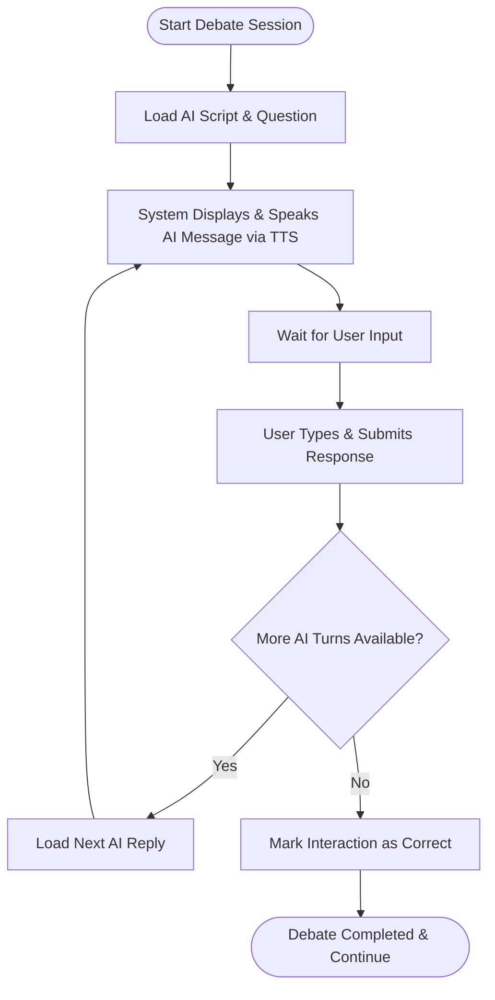

# STEM Education Platform

A modern, interactive Next.js application tailored for dynamic STEM education. Built with diverse learning styles in mind (Auditory, Kinesthetic, Visual), this platform leverages AI to provide engaging assessments, dialogue debates, and rich interactive modules.

## ✨ Key Features
- **Adaptive Learning Modules**: Custom interactive interfaces for Auditory and Kinesthetic learning styles.
- **Interactive Dialogue Debate**: AI-driven debate system to enhance critical thinking through back-and-forth conversational scenarios.
- **Voice Integration**: Built-in Text-to-Speech (TTS) and `react-speech-recognition` for hands-free and auditory-focused experiences.
- **Dynamic Dashboards & Assessments**: Track progress and visualize data using modern charts (`recharts`).
- **AI-Powered Assistance**: Integrated `@ai-sdk/react` for intelligent chat and real-time feedback.
- **Responsive & Accessible UI**: Crafted with `shadcn`, Base UI, and Tailwind CSS, enriched with `framer-motion` animations.

## 🗣️ How the Debate System Works

The Debate System (`DialogueDebate`) is an interactive component designed for auditory learners. It simulates a conversational debate where the AI challenges the user, and the user must respond. 



1. **Initialization**: The module loads a predefined script and question.
2. **AI Opening**: The AI sends the first message and reads it out loud using Text-to-Speech (TTS).
3. **User Turn**: The user types a response in the chat-like interface.
4. **Progression**: The system moves to the next turn, with the AI replying after a short delay.
5. **Completion**: Once the AI script is exhausted, the debate marks the user's progress as correct and allows them to proceed to the next module.

## 🛠️ Tech Stack & Dependencies

- **Framework**: [Next.js](https://nextjs.org/) (v16.2.6) / [React](https://react.dev/) (v19)
- **Styling**: [Tailwind CSS](https://tailwindcss.com/) (v4.2.0)
- **UI Components**: [shadcn/ui](https://ui.shadcn.com/), [@base-ui/react](https://base-ui.com/), `lucide-react`
- **Animations**: [Framer Motion](https://www.framer.com/motion/) (v12.40.0), `tw-animate-css`
- **AI Integration**: `ai`, `@ai-sdk/react`
- **Speech & Audio**: `react-speech-recognition`
- **Data Visualization**: `recharts`

## 🚀 Prerequisites & Installation

### Prerequisites
- Node.js (v18+ recommended)
- npm, yarn, pnpm, or bun

### Installation Steps

1. **Clone the repository:**
   ```bash
   git clone <your-repo-url>
   cd stem-education-platform
   ```

2. **Install dependencies:**
   ```bash
   npm install
   # or yarn install / pnpm install
   ```

3. **Start the development server:**
   ```bash
   npm run dev
   ```

4. **Open the app:**
   Visit [http://localhost:3000](http://localhost:3000) in your browser.

## 💻 Usage Examples or Code Snippets

**Debate Component Usage (`DialogueDebate.tsx`)**
```tsx
import { DialogueDebate } from "@/components/auditory/DialogueDebate";

// Inside a level or screen
<DialogueDebate 
  level={{ 
    question: "Is AI dangerous?", 
    aiScript: [
      "I believe AI poses risks to privacy. What are your thoughts?", 
      "That's a fair point, but what about job displacement?"
    ] 
  }}
  onComplete={(score) => console.log("Debate finished with score:", score)}
  onNext={() => goToNextLevel()}
  ttsSpeak={(text) => window.speechSynthesis.speak(new SpeechSynthesisUtterance(text))}
/>
```

## 🔌 API Documentation

### `POST /api/chat`
Handles AI chat interactions via Vercel AI SDK.
- **Request Body**: `{ "messages": [{ "role": "user", "content": "Hello" }] }`
- **Response**: Streaming text response directly usable with `useChat` from `@ai-sdk/react`.

## 📁 Project Structure Overview

```text
stem-education-platform/
├── app/                  # Next.js App Router (Pages, API Routes, Layouts)
│   ├── api/              # API Endpoints (e.g., chat)
│   ├── assessment/       # Assessment views
│   ├── learn/            # Learning paths & modules
│   └── results/          # User results and progress views
├── components/           # Reusable UI Components
│   ├── auditory/         # Components for Auditory learning (Debate, Audio)
│   ├── dashboard/        # Dashboard layout and widgets
│   └── kinesthetic/      # Interactive tactile components
├── lib/                  # Utility functions and shared definitions
├── public/               # Static assets (images, icons)
├── package.json          # Dependencies and scripts
└── tsconfig.json         # TypeScript configuration
```

## 📸 UI Screenshots

Use these placeholders to drop in screenshots or mockups. Screens are based on frontend routes and components.

**Home / Skill Exchange Feed**

<div align="center">

</div>

**Student Dashboard Overview**

<div align="center">

</div>

**Auditory Module: Dialogue Debate**

<div align="center">

</div>

**Kinesthetic Learning Experience**

<div align="center">

</div>

**Assessment Results**

<div align="center">

</div>

## 🤝 Contribution Guide & License

### Contributing
1. Fork the project.
2. Create your feature branch (`git checkout -b feature/AmazingFeature`).
3. Commit your changes (`git commit -m 'Add some AmazingFeature'`).
4. Push to the branch (`git push origin feature/AmazingFeature`).
5. Open a Pull Request.

### License
This project is licensed under the MIT License - see the LICENSE file for details.
