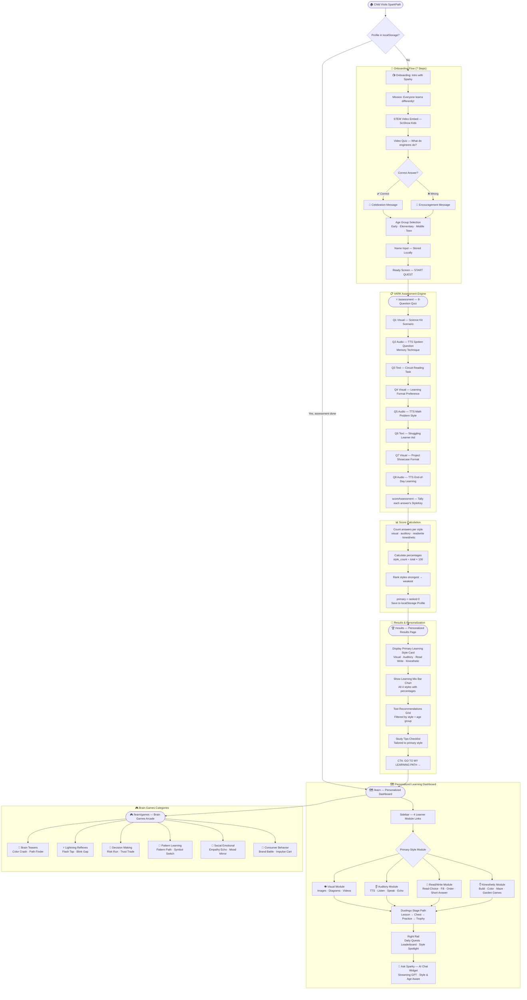

<div align="center">


# ⚡ SparkPath

### *Discover how YOU learn STEM best — then explore the perfect tools to do it.*

A **Duolingo-inspired**, mascot-guided STEM learning platform that identifies each child's unique learning style through a multimodal VARK assessment, then delivers a fully personalized learning path, brain games, and AI-powered tutoring — all with **no account or login required**.

[](https://nextjs.org/)
[](https://react.dev/)
[](https://www.typescriptlang.org/)
[](https://tailwindcss.com/)
[](https://sdk.vercel.ai/)
[](LICENSE)

</div>

---

## 📋 Table of Contents

- [Project Overview](#-project-overview)
- [Key Features](#-key-features)
- [How the Assessment System Works](#-how-the-assessment-system-works)
- [Tech Stack & Dependencies](#-tech-stack--dependencies)
- [Prerequisites & Installation](#-prerequisites--installation)
- [Usage Examples](#-usage-examples)
- [API Documentation](#-api-documentation)
- [Project Structure](#-project-structure)
- [UI Screenshots](#-ui-screenshots)
- [Contribution Guide](#-contribution-guide)
- [License](#-license)

---

## 🌟 Project Overview

**SparkPath** is a privacy-first, child-safe STEM learning web application for ages **3–18**. Guided by **Sparky**, a cheerful animated mascot, children go through a fun onboarding adventure, complete a multimodal VARK-style quiz, and receive a fully personalized learning profile — all stored locally on the device, no account required.

The platform then routes each child into one of four *Learner Modules* (Visual, Auditory, Read/Write, Kinesthetic) and offers:

- Duolingo-style stage progression within their primary learning style
- A rich **Brain Games** arcade covering cognitive, social-emotional, decision-making, and perception categories
- An **AI chat guide** (Sparky) powered by GPT, tuned specifically for child-safe STEM learning tool recommendations

---

## ✨ Key Features

- 🎯 **VARK-Based Learning Style Detection** — 8-question multimodal assessment (visual, audio, text modalities) scientifically maps children to one of four styles: Visual, Auditory, Read/Write, or Kinesthetic
- 🧭 **Guided Mascot Onboarding** — 7-step animated onboarding flow with video, embedded quiz, age selection, and name capture; no sign-up required
- 🗺️ **Personalized Stage Path** — Duolingo-style winding lesson map, unique per learning style, with lesson, chest, practice, and trophy stage types
- 🧠 **Rich Learner Modules** — Four fully distinct modules with age-adaptive STEM content for Early (3–5), Elementary (6–8), Middle (9–12), and Teen (13–18) groups
- 🎮 **Sparky's Brain Games Arcade** — 12 research-valid mini-games across 6 categories: Brain Teasers, Lightning Reflexes, Decision-Making, Pattern Learning, Social-Emotional, and Consumer Behavior
- 🤖 **AI Chat with Sparky** — A streaming AI assistant (Vercel AI SDK + GPT) that recommends learning tools and techniques tailored to each child's style and age group
- 📊 **Style Results Dashboard** — Animated breakdown of learning-style mix (percentages), curated tool recommendations, and personalized study tips
- 🔥 **XP & Progress Tracking** — Sparks (XP), streak counters, hearts, and daily quests — all persisted in `localStorage`, zero backend
- 🔒 **Privacy-First by Design** — No accounts, no tracking, no ads; all data stays on device
- 📱 **Fully Responsive** — Mobile-first layout with a desktop sidebar, mobile top nav, and adaptive content

---

## 🔄 How the Assessment System Works

The assessment is the core engine of SparkPath. It determines the child's **primary learning style** and drives all downstream personalization. Here is the complete flow from the moment a child lands on the site through to their personalized results:

### Complete Assessment Flow Diagram



---

### Assessment Scoring Detail

Each of the 8 questions maps its 4 answer options to a `StyleKey`:

| Option Label (example from Q1) | Maps to Style |
|---|---|
| "Watch the video showing how it works" | `visual` |
| "Listen to someone explain it to me" | `auditory` |
| "Read the instruction booklet" | `readwrite` |
| "Just start building it with my hands" | `kinesthetic` |

After all answers are collected, the `scoreAssessment()` function in [`lib/assessment.ts`](lib/assessment.ts) tallies scores:

```typescript
// Simplified scoring logic
const scores = { visual: 0, auditory: 0, readwrite: 0, kinesthetic: 0 }
for (const style of Object.values(answers)) {
  scores[style] += 1
}
const total = Object.values(scores).reduce((a, b) => a + b, 0)
const percentages = {
  visual:       Math.round((scores.visual / total) * 100),
  auditory:     Math.round((scores.auditory / total) * 100),
  readwrite:    Math.round((scores.readwrite / total) * 100),
  kinesthetic:  Math.round((scores.kinesthetic / total) * 100),
}
const ranked = Object.keys(scores).sort((a, b) => scores[b] - scores[a])
// ranked[0] = primaryStyle
```

The result is persisted to `localStorage` under key `sparkpath_profile_v1` and drives all subsequent routing and content delivery.

---

### Question Modality Types

SparkPath intentionally delivers each question in a **different sensory modality** so the assessment experience itself samples every learning channel:

| Modality | Label | How It Works |
|---|---|---|
| `visual` | 👁️ LOOK | Image-based cards and visual scenario prompts |
| `audio` | 🔊 LISTEN | Auto-played TTS via `SpeechSynthesisUtterance`; replay button available |
| `text` | 📖 READ | Written passage the child reads silently, then answers |

---

## 🛠 Tech Stack & Dependencies

### Core Framework

| Package | Version | Role |
|---|---|---|
| `next` | 16.2.6 | App Router SSR + API Routes |
| `react` / `react-dom` | ^19 | UI rendering |
| `typescript` | 5.7.3 | Type safety |

### AI & Streaming

| Package | Version | Role |
|---|---|---|
| `ai` | ^6.0.205 | Vercel AI SDK — `streamText`, `convertToModelMessages` |
| `@ai-sdk/react` | ^3.0.207 | `useChat` hook for client-side streaming |

### UI & Styling

| Package | Version | Role |
|---|---|---|
| `tailwindcss` | ^4.2.0 | Utility-first CSS |
| `shadcn` / `@base-ui/react` | latest | Accessible component primitives |
| `framer-motion` / `motion` | ^12.40.0 | Page transitions & micro-animations |
| `lucide-react` | ^1.16.0 | Icon library |
| `class-variance-authority` | ^0.7.1 | Component variant management |
| `clsx` + `tailwind-merge` | latest | Conditional className composition |

### Additional Libraries

| Package | Role |
|---|---|
| `react-confetti` | Celebration animation on assessment completion |
| `react-speech-recognition` | Voice input support in auditory module |
| `recharts` | Progress & score charts |
| `@vercel/analytics` | Production usage analytics |

---

## 📦 Prerequisites & Installation

### Prerequisites

- **Node.js** ≥ 18.0.0
- **npm** ≥ 9 or **pnpm** ≥ 8
- An **OpenAI-compatible API key** for the Sparky AI chat feature

### 1. Clone the Repository

```bash
git clone https://github.com/VipulMore11/Sparky.git
cd Sparky
```

### 2. Install Dependencies

```bash
# Using npm
npm install

# Or using pnpm (recommended — lock file included)
pnpm install
```

### 3. Configure Environment Variables

Create a `.env.local` file in the project root:

```env
# OpenAI or OpenAI-compatible API key
# The chat route uses model: "openai/gpt-5.4-mini"
OPENAI_API_KEY=sk-...your-key-here...
```

> **Note:** The Sparky AI chat (`/api/chat`) is the only feature requiring an API key. All assessment, learning modules, and games work fully offline without it.

### 4. Start the Development Server

```bash
npm run dev
# or
pnpm dev
```

Open [http://localhost:3000](http://localhost:3000) in your browser.

### 5. Build for Production

```bash
npm run build
npm run start
```

---

## 💻 Usage Examples

### Starting the Assessment Programmatically

The assessment is driven by the `useProfile` hook and the `QUESTIONS` array:

```typescript
import { QUESTIONS, scoreAssessment, type Answers } from "@/lib/assessment"
import { useProfile } from "@/lib/use-profile"

// Record a child's answer
const answers: Answers = {}
answers["q1"] = "visual"   // child chose visual option on Q1
answers["q2"] = "auditory" // child chose auditory option on Q2
// ... 8 answers total

// Score the assessment
const result = scoreAssessment(answers)
console.log(result.primary)      // "visual"
console.log(result.percentages)  // { visual: 50, auditory: 25, readwrite: 13, kinesthetic: 13 }
console.log(result.ranked)       // ["visual", "auditory", "readwrite", "kinesthetic"]
```

### Accessing & Updating the Learner Profile

All profile state is managed through `useProfile()` — a custom hook backed by `localStorage`:

```typescript
import { useProfile } from "@/lib/use-profile"

function MyComponent() {
  const { profile, ready, update, reset } = useProfile()

  if (!ready) return <div>Loading...</div>

  return (
    <div>
      <p>Name: {profile.name}</p>
      <p>Primary style: {profile.primaryStyle}</p>
      <p>Sparks earned: {profile.sparks}</p>
      <p>Age group: {profile.ageGroup}</p>
    </div>
  )

  // Update after completing a stage
  update({ sparks: profile.sparks + 10, progress: { ...profile.progress, visual: 3 } })

  // Reset everything (retake quiz)
  reset()
}
```

### Getting Tool Recommendations for a Style + Age

```typescript
import { RECOMMENDATIONS } from "@/lib/learning-styles"

// Get tools for a visual, middle-school learner
const tools = RECOMMENDATIONS["visual"]["middle"]
// [
//   { name: "PhET Simulations", what: "Interactive science visuals",
//     how: "Drag the sliders and watch the diagram change in real time.", free: true },
//   { name: "Khan Academy", what: "Whiteboard video lessons",
//     how: "Watch the drawn-out steps, pause, and sketch them yourself.", free: true }
// ]
```

### Sending a Message to Sparky (AI Chat)

```typescript
import { useChat } from "@ai-sdk/react"
import { DefaultChatTransport } from "ai"

const { messages, sendMessage, status } = useChat({
  transport: new DefaultChatTransport({
    api: "/api/chat",
    prepareSendMessagesRequest: ({ messages }) => ({
      body: {
        messages,
        context: {
          name: "Alex",
          style: "Visual Learner",  // passed to system prompt
          ageGroup: "middle",
        },
      },
    }),
  }),
})

// Send a message
sendMessage({ text: "What apps are good for me?" })
```

---

## 📡 API Documentation

### `POST /api/chat`

Streams a child-safe AI response from Sparky, the SparkPath mascot guide.

**Endpoint:** `POST /api/chat`
**Max Duration:** 30 seconds (streaming)
**Content-Type:** `application/json`

#### Request Body

```json
{
  "messages": [
    {
      "id": "msg-1",
      "role": "user",
      "parts": [{ "type": "text", "text": "What apps are good for me?" }]
    }
  ],
  "context": {
    "name": "Alex",
    "style": "Visual Learner",
    "ageGroup": "middle"
  }
}
```

| Field | Type | Required | Description |
|---|---|---|---|
| `messages` | `UIMessage[]` | ✅ | Full conversation history (Vercel AI SDK `UIMessage` format) |
| `context.name` | `string` | ❌ | Child's first name or nickname (defaults to "the learner") |
| `context.style` | `string` | ❌ | Primary learning style label (defaults to "mixed") |
| `context.ageGroup` | `"early" \| "elementary" \| "middle" \| "teen"` | ❌ | Age group (defaults to "unknown") |

#### Response

Returns a **streaming UI message response** (Vercel AI SDK format — `text/event-stream`).

Each SSE event delivers incremental text chunks. The client-side `useChat` hook processes these automatically.

#### System Prompt Behavior

Sparky is instructed to:
- Guide on **HOW** to learn (tools, platforms, techniques) — never **WHAT** to study
- Keep replies to 2–4 sentences, warm and playful
- Use age-appropriate language (very simple for early/elementary)
- Never ask for personal information
- Stay in character as Sparky at all times

#### Example Response (streamed)

```
"Hi Alex! For a visual learner like you, Khan Academy is amazing — 
watch the colorful whiteboard videos and then try sketching what you saw. 
PhET Simulations is also great for seeing science in action with sliders and graphs!"
```

#### Error Responses

| Status | Meaning |
|---|---|
| `400` | Malformed request body |
| `401` | Missing or invalid `OPENAI_API_KEY` |
| `500` | Upstream model error |

---

## 📁 Project Structure

```
stem-education-platform/
│
├── app/                          # Next.js App Router
│   ├── layout.tsx                # Root layout (fonts, metadata, analytics)
│   ├── page.tsx                  # Home → OnboardingFlow
│   ├── assessment/
│   │   └── page.tsx              # Assessment route → AssessmentFlow
│   ├── results/
│   │   └── page.tsx              # Results route → ResultsView
│   ├── learn/
│   │   ├── page.tsx              # Redirects to /learn/[primaryStyle]
│   │   ├── [style]/
│   │   │   └── page.tsx          # Learner module page (visual/auditory/rw/kinesthetic)
│   │   └── games/
│   │       ├── page.tsx          # Brain Games arcade hub
│   │       ├── cognitive/        # Stroop Sprint, Trail Tracker
│   │       ├── perception-reaction/  # Flash Reflex, Blink Gap
│   │       ├── decision-making/  # Risk Run, Trust Trade
│   │       ├── learning-pattern/ # Pattern Path, Symbol Switch
│   │       ├── social-emotional/ # Empathy Echo, Mood Mirror
│   │       └── consumer-behavior/ # Brand Battle, Impulse Cart
│   └── api/
│       └── chat/
│           └── route.ts          # Sparky AI streaming chat endpoint
│
├── components/
│   ├── assessment-flow.tsx       # 8-question VARK assessment UI
│   ├── onboarding-flow.tsx       # 7-step intro wizard
│   ├── results-view.tsx          # Style results, tools, tips
│   ├── flow-shell.tsx            # Shared shell for onboarding/assessment
│   ├── mascot.tsx                # Sparky mascot + SpeechBubble
│   ├── dashboard/
│   │   ├── dashboard-shell.tsx   # Sidebar + MobileNav wrapper
│   │   ├── sidebar.tsx           # Desktop sidebar + MobileModuleNav
│   │   ├── stage-path.tsx        # Duolingo-style winding stage map
│   │   ├── right-rail.tsx        # Daily quests, leaderboard, style spotlight
│   │   ├── mascot-chat.tsx       # Floating AI chat widget (Sparky)
│   │   ├── rw-lesson-player.tsx  # Read/Write lesson engine
│   │   └── rw-step-views.tsx     # Individual step renderers (choice/fill/order/short)
│   ├── visual/                   # Visual module interaction components
│   │   ├── VisualApp.tsx
│   │   ├── ImageChoice.tsx
│   │   ├── LabelDiagram.tsx
│   │   ├── MatchPairs.tsx
│   │   ├── ReadChart.tsx
│   │   ├── BuildPattern.tsx
│   │   ├── SequenceImages.tsx
│   │   ├── FillBlankWithVisual.tsx
│   │   ├── SpotDifference.tsx
│   │   └── BlockReport.tsx
│   ├── auditory/                 # Auditory module interaction components
│   │   ├── AuditoryApp.tsx
│   │   ├── ListenAndChoose.tsx
│   │   ├── ListenAndMatch.tsx
│   │   ├── ListenAndSequence.tsx
│   │   ├── Echo.tsx              # Repeat-after-me exercise
│   │   ├── SpeakShortAnswer.tsx
│   │   ├── RecordExplanation.tsx
│   │   ├── DialogueDebate.tsx
│   │   └── TypeWriteFallback.tsx
│   ├── kinesthetic/              # Kinesthetic module games
│   │   ├── KinestheticApp.tsx
│   │   ├── ColorLab.tsx
│   │   ├── BridgeBuilder.tsx
│   │   ├── WaterPath.tsx
│   │   ├── AnimalHouse.tsx
│   │   ├── Garden.tsx
│   │   ├── PuppyMaze.tsx
│   │   ├── Playground.tsx
│   │   ├── MiddleIceCream.tsx
│   │   ├── MiddlePetRobot.tsx
│   │   ├── MiddleTreehouse.tsx
│   │   ├── MiddleWaterPark.tsx
│   │   ├── TeenDreamRoom.tsx
│   │   ├── TeenEscapeRoom.tsx
│   │   ├── TeenFoodTruck.tsx
│   │   ├── TeenThemePark.tsx
│   │   ├── GameShell.tsx
│   │   └── Results.tsx
│   └── ui/                       # shadcn/ui primitives (Button, Card, Badge…)
│
├── lib/
│   ├── assessment.ts             # QUESTIONS array + scoreAssessment()
│   ├── learning-styles.ts        # StyleKey types, LEARNING_STYLES, RECOMMENDATIONS, STUDY_TIPS
│   ├── stages.ts                 # Stage definitions + getStages() per module
│   ├── rw-content.ts             # Age-grouped Read/Write lesson content (4 age tiers)
│   ├── rw-types.ts               # TypeScript types for R/W lesson steps
│   ├── rw-grading.ts             # Keyword-based short-answer grading logic
│   ├── auditory-levels.ts        # Auditory lesson content per age group
│   ├── visual-levels.ts          # Visual lesson content per age group
│   ├── visual-store.ts           # Visual module progress state
│   ├── kinesthetic-store.ts      # Kinesthetic module progress state
│   ├── use-profile.ts            # useProfile() hook — localStorage profile manager
│   └── utils.ts                  # cn() className helper
│
├── public/                       # Static assets
│   ├── mascot.png                # Sparky mascot image
│   ├── icon.svg / icon-*.png    # App icons (light/dark + Apple)
│   └── placeholder-*.svg/png    # Layout placeholder assets
│
├── Screenshots/                  # UI screenshots for documentation
│
├── next.config.mjs               # Next.js configuration
├── tsconfig.json                 # TypeScript configuration
├── components.json               # shadcn/ui component registry config
├── postcss.config.mjs            # PostCSS + Tailwind setup
└── package.json                  # Dependencies and scripts
```

---

## 📸 UI Screenshots

### 1. Welcome / Onboarding — Sparky Introduction

<div align="center">

</div>

> Sparky greets the child, explains the platform's mission, and begins the 7-step onboarding flow. No sign-up required.

---

### 2. Assessment — VARK-Style Quiz

<div align="center">

</div>

> Each of the 8 questions is delivered in one of three modalities: visual prompt, TTS audio, or text passage. The child taps their best-fit answer from 4 styled option cards.

---

### 3. Results — Personalized Learning Profile

<div align="center">

</div>

> After the assessment, the child sees their primary learning style, a full learning-mix bar chart, curated tool recommendations (filtered by style + age), and personalized study tips.

---

### 4. Learning Dashboard — Duolingo-Style Stage Path

<div align="center">

</div>

> The main learning hub: a winding stage path unique to the child's primary style, with XP sparks, streak counter, hearts, daily quests, and a leaderboard unlock tracker in the right rail.

---

### 5. Sparky's Brain Games Arcade

<div align="center">

</div>

> 12 research-valid mini-games across 6 categories. Each card shows game name, description, difficulty badge, duration, and a "Why play this?" rationale.

---

### 6. Ask Sparky — AI Chat Widget

<div align="center">

</div>

> Floating AI chat panel powered by a streaming GPT endpoint. Sparky knows the child's name, learning style, and age group, and responds with warm, 2–4 sentence tool recommendations. Quick-reply suggestions are shown on first open.

---

## 🤝 Contribution Guide

We welcome contributions of all kinds — bug fixes, new brain games, new lesson content, accessibility improvements, and documentation!

### Getting Started

1. **Fork** the repository on GitHub
2. **Clone** your fork:
   ```bash
   git clone https://github.com/YOUR_USERNAME/Sparky.git
   cd Sparky
   ```
3. **Create a feature branch:**
   ```bash
   git checkout -b feat/your-feature-name
   ```
4. **Install dependencies** and start the dev server:
   ```bash
   pnpm install && pnpm dev
   ```

### Development Guidelines

- **TypeScript is required** — all new files must be `.ts` or `.tsx` with proper typing
- **Follow the existing component pattern** — use `"use client"` only where client-side hooks are needed
- **Learning content** — never prescribe *what* to study; guide on *how* to learn and which tools help
- **Child safety first** — all text and AI prompts must be age-appropriate, encouraging, and safe
- **No new server-side state** — the app is intentionally zero-backend except for the chat API; profile state stays in `localStorage`
- **Respect the VARK framework** — new assessment questions must map options to `StyleKey` values

### Adding a New Brain Game

1. Create your game component under `app/learn/games/[category]/[game-name]/page.tsx`
2. Add the game entry to the `gameCategories` array in `app/learn/games/page.tsx`
3. Include `name`, `description`, `concept`, `difficulty`, `duration`, and `href`

### Adding New R/W Lesson Content

Age-grouped lesson content lives in [`lib/rw-content.ts`](lib/rw-content.ts). Each lesson follows this schema:

```typescript
{
  id: "rw-l4",
  title: "Your Lesson Title",
  subtitle: "Short description",
  xp: 20,
  steps: [
    { kind: "intro", title: "Step Title", body: "Intro text." },
    { kind: "read-choice", prompt: "Question?", options: ["A", "B", "C", "D"], answer: 0 },
    { kind: "write-fill", prompt: "Fill: ___ is correct.", before: "", after: "", answers: ["answer"] },
    { kind: "write-short", prompt: "Explain...", keywords: ["key1", "key2"], minKeywords: 1 },
  ]
}
```

### Submitting a Pull Request

1. Ensure no TypeScript errors: `npm run build`
2. Lint your code: `npm run lint`
3. Write a clear PR description explaining *what* changed and *why*
4. Reference any related issues with `Closes #<issue-number>`

### Reporting Issues

Please use [GitHub Issues](https://github.com/VipulMore11/Sparky/issues) and include:
- Your environment (OS, Node version, browser)
- Steps to reproduce
- Expected vs actual behavior
- Screenshots if relevant

---

## 📄 License

This project is licensed under the **MIT License**.

```
MIT License

Copyright (c) 2026 VipulMore11

Permission is hereby granted, free of charge, to any person obtaining a copy
of this software and associated documentation files (the "Software"), to deal
in the Software without restriction, including without limitation the rights
to use, copy, modify, merge, publish, distribute, sublicense, and/or sell
copies of the Software, and to permit persons to whom the Software is
furnished to do so, subject to the following conditions:

The above copyright notice and this permission notice shall be included in all
copies or substantial portions of the Software.

THE SOFTWARE IS PROVIDED "AS IS", WITHOUT WARRANTY OF ANY KIND, EXPRESS OR
IMPLIED, INCLUDING BUT NOT LIMITED TO THE WARRANTIES OF MERCHANTABILITY,
FITNESS FOR A PARTICULAR PURPOSE AND NONINFRINGEMENT. IN NO EVENT SHALL THE
AUTHORS OR COPYRIGHT HOLDERS BE LIABLE FOR ANY CLAIM, DAMAGES OR OTHER
LIABILITY, WHETHER IN AN ACTION OF CONTRACT, TORT OR OTHERWISE, ARISING FROM,
OUT OF OR IN CONNECTION WITH THE SOFTWARE OR THE USE OR OTHER DEALINGS IN THE
SOFTWARE.
```

---

<div align="center">

Built with ❤️ for curious young minds everywhere.

**[⭐ Star this repo](https://github.com/VipulMore11/Sparky)** if SparkPath sparks something in you!

</div>
